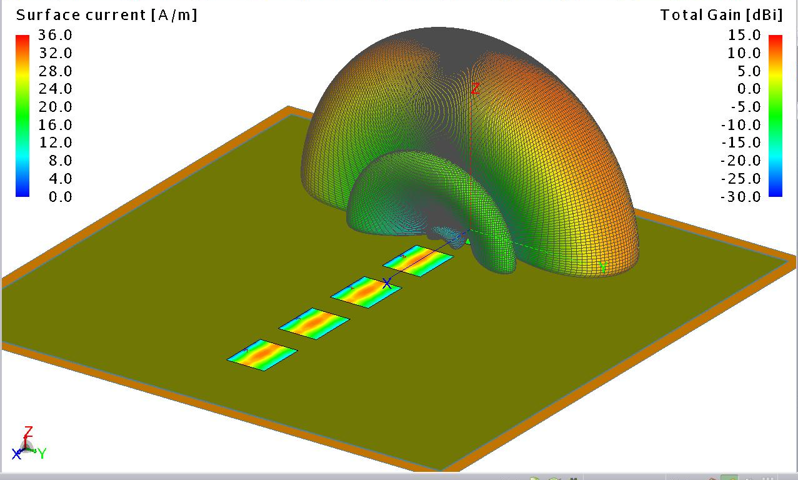
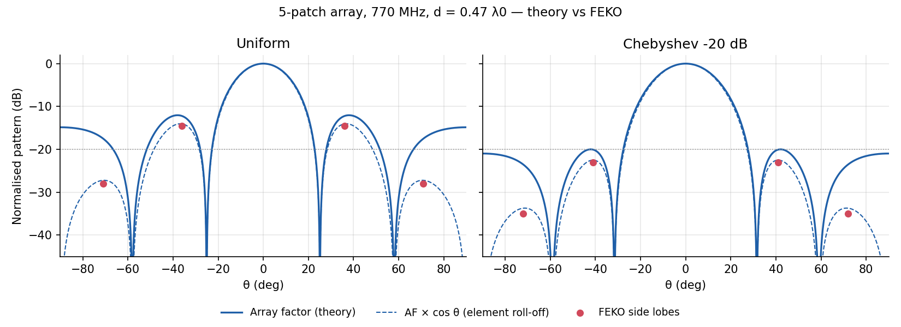
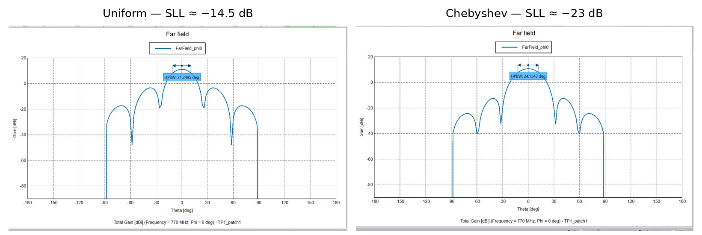
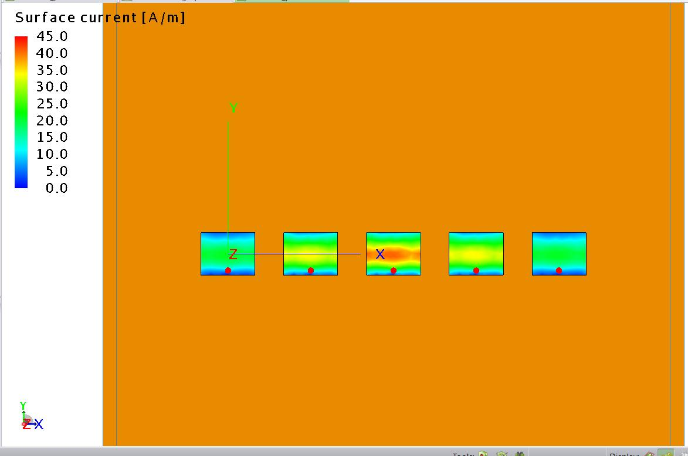
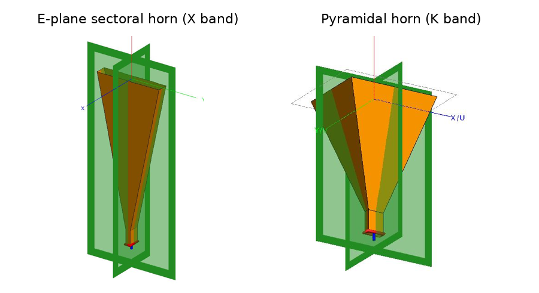
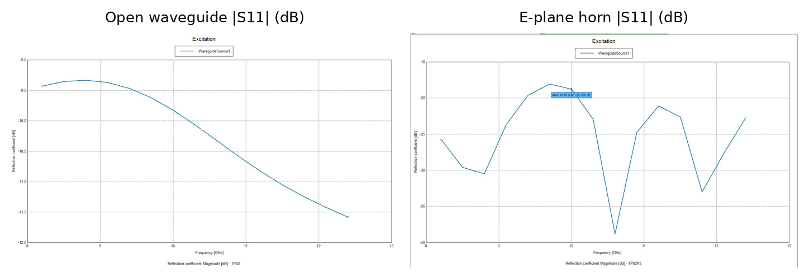
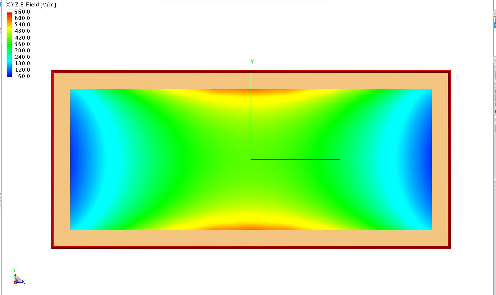

# Antenna design & simulation — Altair FEKO

Full-wave (MoM) simulation of microstrip patch arrays and waveguide horn antennas, checked against closed-form theory in Python.

**Tools:** Altair FEKO (CADFEKO / POSTFEKO), Python (NumPy, SciPy, Matplotlib)  
**Context:** M1 Systèmes Communicants lab work, Sorbonne Université (UM4EE205 Antennas, 2025–26)

---

## Key results

| Antenna | Band | FEKO result | Theory check |
|---|---|---|---|
| 5-patch linear array, uniform | 770 MHz | 11 dBi, HPBW 21.3°, SLL −14.5 dB | AF × element: SLL −14.0 dB |
| 5-patch array, Dolph-Chebyshev (−20 dB) | 770 MHz | 10.5 dBi, HPBW 24.1°, SLL −23 dB | AF × element: SLL −22.5 dB |
| Open-ended WR-90 waveguide | 8.2–12.4 GHz | 5.1–7.3 dBi, \|S11\| −9 to −12 dB | aperture only 0.76 λ × 0.34 λ |
| E-plane sectoral horn (WR-90) | 8.2–12.4 GHz | 14.9–16.7 dBi, \|S11\| ≤ −18 dB | Balanis: 13.2–16.0 dBi |
| Pyramidal horn (WR-42) | 18–26.5 GHz | 18.9–20.9 dBi | aperture estimate: 18.2–21.5 dBi |

---

## 1. Patch array at 770 MHz

Five probe-fed patches (εr = 4.5, infinite substrate) spaced d = 0.47 λ0 along x.



*3D gain pattern: fan beam, narrow in the array plane and broad across it.*

**Chebyshev tapering.** The element amplitudes 1 : 1.61 : 1.93 : 1.61 : 1 (the center patch is driven hardest) trade 0.5 dB of gain and 3° of beamwidth for side lobes that are 8.5 dB lower.



**Theory vs simulation.**

- Null positions match the analytical array factor (AF) to within about 1°: 25° / 58° for uniform, 32° / 60° for Chebyshev.
- FEKO's side lobes sit 2.5–3 dB *below* the pure AF (−23 dB instead of the −20 dB design target, −14.5 dB instead of −12 dB for uniform). The reason is the element pattern: a patch over a ground plane radiates less toward the horizon, which pushes the side lobes down. Multiplying the AF by a simple cos θ roll-off reproduces the FEKO levels to within 0.5 dB.
- Doubling the spacing to d = 0.94 λ0 halves the beamwidth (FEKO 10.7°, AF 11.0°), but the array sits right at the grating-lobe limit (sin θ = 1.06).

<details><summary>Raw FEKO cuts</summary>




</details>

---

## 2. Horn antennas (X and K band)



**Open waveguide → horn.** The bare WR-90 opening is a sharp jump from the guide to free space, so a lot of power reflects back (|S11| ≈ −10 dB). Flaring the E-plane acts as a gradual impedance taper: |S11| drops to −18 dB or better across the whole band and the gain rises by about 9 dB.



**Design lesson.** The 19 dBi target was not reachable with a flare length of ρ1 = 11 λ. Balanis' closed-form directivity gives 14.6 dBi for these dimensions (FEKO: 15.8 dBi). Reaching 19 dBi with an E-plane-only flare would need ρ1 ≈ 82 λ, about 2.5 m, which is why real standard-gain horns flare both planes (pyramidal).

**Catalog check (K band).** Simulating a 20 dBi pyramidal horn across 18–26.5 GHz shows the gain rising from 18.9 to 20.9 dBi. The datasheet value is a mid-band nominal, not a guaranteed minimum.

<details><summary>TE10 field at the waveguide aperture</summary>



cos(πx/a) variation along the wide side and nearly uniform along the narrow side, as expected for the TE10 mode.

</details>

---

## Repository

```
├── README.md
├── LICENSE
├── requirements.txt
├── analysis/
│   ├── theory_check.py   # array factor, Balanis horn directivity, aperture estimate
│   └── output.txt        # script output (numbers used in the tables above)
└── figures/
```

```bash
pip install -r requirements.txt
cd analysis && python theory_check.py
```

## Limitations

- In the array configuration the ports are not matched (|Γ| ≈ 0.7 at best, about −3 dB): the single-patch feed was not re-tuned for mutual coupling. The array results above concern radiation patterns only.
- cos θ is a crude stand-in for the patch element pattern, used only to explain the trend in side-lobe level.
- For the E-plane horn, FEKO gain (15.8 dBi at 10 GHz) is about 1.2 dB above the Balanis directivity (14.6 dBi). Balanis' formula is an approximation that ignores the flange and finite ground plane of the model, so the two are compared as orders of magnitude, not as an exact match.
- FEKO values in `theory_check.py` were read off the POSTFEKO cuts, not exported as data.
- The horn frequency sweeps are coarse (~15 points), so the S11 curves are only indicative between samples.

---

Simulations, analysis and code: **Mohand Chabane Chaouche**. The lab report was co-submitted in pairs with A. Abdelmagid (pairing was for grading convenience).

Author: **Mohand Chabane Chaouche** · [LinkedIn](https://www.linkedin.com/in/mohandchabane-chaouche-9a515b2a7/)
