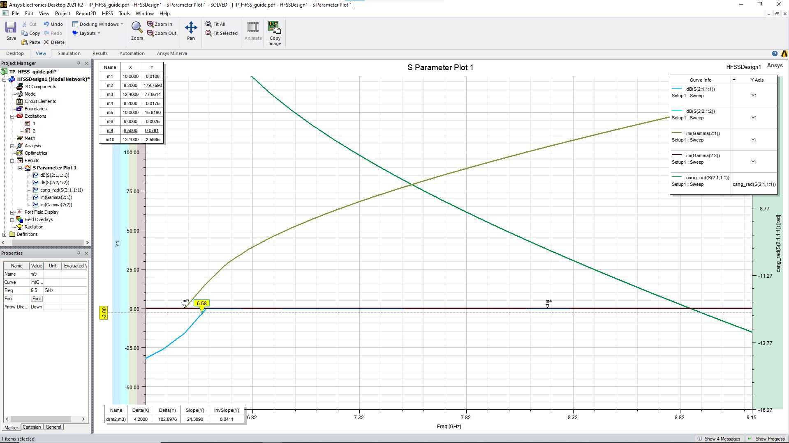

# WR90 rectangular waveguide in HFSS, with an analytical check

Ansys HFSS (Electronics Desktop 2021 R2) simulation of a WR90 guide, compared with Pozar's formulas in Python. M1 Systèmes Communicants, Sorbonne Université. [Back to the overview](../README.md).

- **Tools:** Ansys HFSS (finite-element), Python (numpy, matplotlib).
- **Results:** HFSS and theory agree within **0.5 %** on the TE10 and TE20 cutoffs, the guided wavelength and the attenuation at 10 GHz.

## Structure

| Item | Value |
| --- | --- |
| Guide | Air-filled WR90, a = 22.86 mm, b = 10.16 mm, length 100 mm |
| Walls | Copper, 1 mm, σ = 5.8 × 10⁷ S/m |
| Ports | Two wave ports, 2 modes each (to see TE20) |
| Band | 8.2-12.4 GHz (manufacturer) |

## Results

| Quantity | HFSS | Theory | Difference |
| --- | --- | --- | --- |
| TE10 cutoff | 6.58 GHz | 6.557 GHz | +0.35 % |
| TE20 cutoff | 13.17 GHz | 13.114 GHz | +0.42 % |
| S21 phase at 10 GHz | −15.819 rad | −15.82 rad (β·L) | 0.0 % |
| Guided wavelength at 10 GHz | 39.72 mm | 39.71 mm | +0.03 % |
| Phase constant β at 10 GHz | 158.2 rad/m | 158.2 rad/m | 0.0 % |
| Attenuation at 10 GHz | 0.108 dB/m | 0.1084 dB/m | −0.4 % |

Single-mode band: **6.557 to 13.114 GHz**, which contains the 8.2-12.4 GHz manufacturer band.

**S21 and TE20 curves (HFSS)**


**S21 phase and magnitude markers at 10 GHz (HFSS)**



**3D E-field of the TE10 mode (HFSS)**


**Dispersion and attenuation: theory with the HFSS point at 10 GHz**


## Run the code

```bash
python wr90_theory.py
```

The script prints the comparison table and writes the two analytical plots. Formulas: D. M. Pozar, *Microwave Engineering*.
