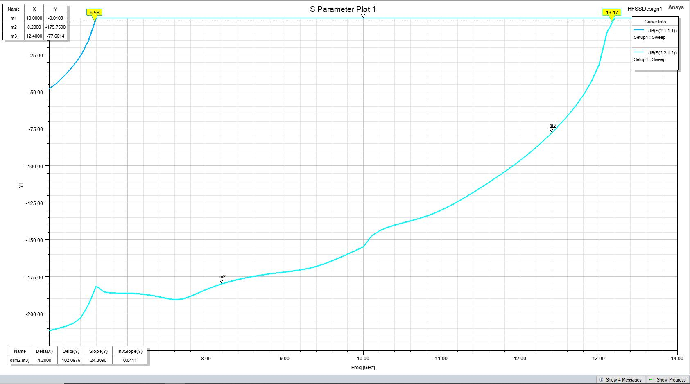
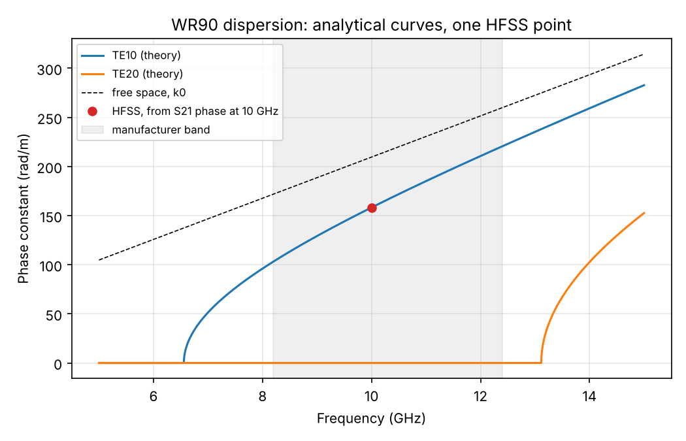
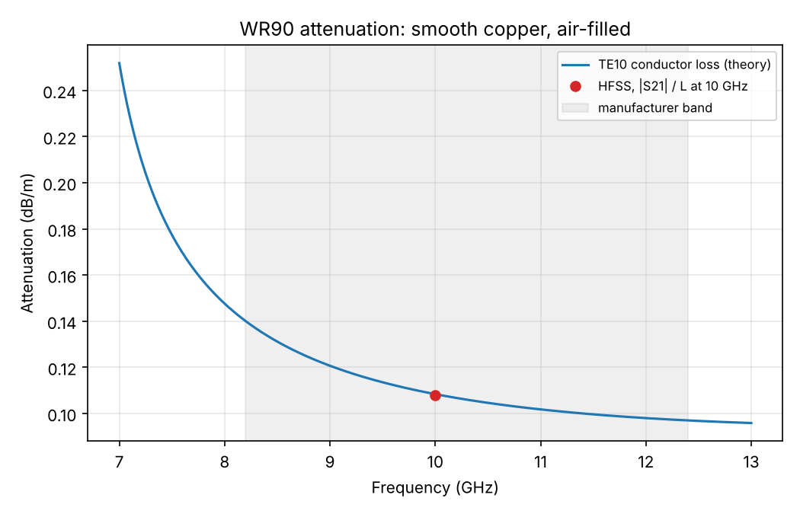
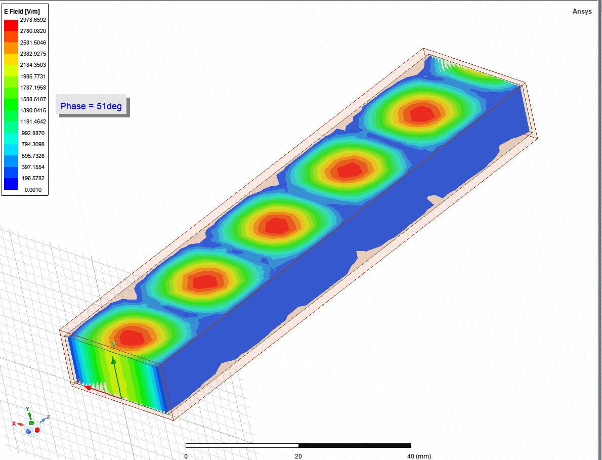

# WR90 rectangular waveguide: HFSS lab and analytical check

## In plain words

- This folder covers one lab from my M1 (Systèmes Communicants, Sorbonne Université): a WR90 waveguide simulated in Ansys HFSS.
- Everything here is **simulated**. Nothing was measured on hardware.
- I ran the simulation in the lab and kept screenshots of the results. I did not keep the HFSS project file, so the simulation can't be rerun from this repo.
- `wr90_theory.py` computes the same quantities from textbook formulas (cutoff frequencies, phase constant, guided wavelength, conductor loss) and prints them next to the HFSS values read from the screenshots.
- At the points I can back with a screenshot, HFSS and theory agree within about 0.5 %.
- The lab also covered a circular guide. It is not included, because I have no HFSS captures of it.

## Tools and roles

| Tool | Role |
|---|---|
| Ansys HFSS (Electronics Desktop 2021 R2, from the screenshot title bar) | Full-wave finite-element simulation of the guide |
| Python (numpy, matplotlib) | Independent analytical model, plots, comparison table |

## Structure

- Air-filled WR90: inner width a = 22.86 mm, inner height b = 10.16 mm, length 100 mm.
- Copper walls, 1 mm thick, σ = 5.8 × 10⁷ S/m.
- Two wave ports, one at each end. A second mode was enabled on the ports to see the TE20 cutoff, as the lab statement asks.
- Manufacturer band: 8.2 to 12.4 GHz.

## Status

| Result | Evidence level | Source |
|---|---|---|
| TE10 cutoff (-3 dB point of S21) | Simulated, screenshot kept | `figures/hfss_s21_cutoffs.jpg` |
| TE20 cutoff (-3 dB point, mode 2 to mode 2) | Simulated, screenshot kept | `figures/hfss_s21_cutoffs.jpg` |
| Guided wavelength at 10 GHz, from the S21 phase | Simulated, marker visible in screenshot | `figures/hfss_s21_phase_window.jpg` |
| Attenuation at 10 GHz, from \|S21\| / length | Simulated, marker visible in screenshot | `figures/hfss_s21_phase_window.jpg` |
| 3D E-field of the TE10 standing pattern | Simulated, screenshot kept | `figures/hfss_e_field_3d.jpg` |
| Dispersion curves and attenuation curve in `figures/wr90_*.png` | Analytical model, not HFSS | `wr90_theory.py` |
| Attenuation at other frequencies in the band | Not included (see Limitations) | none |
| Anything on a real waveguide | Not done | none |

## Results

Theory uses c = 299 792 458 m/s. HFSS values are read from the screenshots.

| Quantity | HFSS | Theory | Difference |
|---|---|---|---|
| TE10 cutoff | 6.58 GHz | 6.557 GHz | +0.35 % |
| TE20 cutoff | 13.17 GHz | 13.114 GHz | +0.42 % |
| Phase of S21 at 10 GHz | -15.819 rad | -15.82 rad (β·L) | 0.0 % |
| Guided wavelength at 10 GHz | 39.72 mm | 39.71 mm | +0.03 % |
| Phase constant β at 10 GHz | 158.2 rad/m | 158.2 rad/m | 0.0 % |
| Attenuation at 10 GHz | 0.108 dB/m | 0.1084 dB/m | -0.4 % |

The single-mode band of the guide is 6.557 to 13.114 GHz. The manufacturer band, 8.2 to 12.4 GHz, sits inside it.

Theory attenuation across the manufacturer band, for reference: 0.140 dB/m at 8.2 GHz, 0.115 at 9.4, 0.108 at 10, 0.097 at 12.4.









## Run the code

```
pip install numpy matplotlib
python wr90_theory.py
```

The script prints the comparison tables and rewrites `figures/wr90_dispersion.png` and `figures/wr90_attenuation.png`. The HFSS numbers are constants at the top of the script, with a comment saying which screenshot marker each one comes from.

## Limitations

- **No project file.** I kept screenshots only. The mesh settings, number of adaptive passes and frequency step are not recorded.
- **Cutoff read-off.** The cutoff is the -3 dB point of a transmission curve on a finite 100 mm guide. The 0.35 % and 0.42 % differences are within what this read-off can resolve. They are not an accuracy claim about HFSS.
- **Attenuation checked at one point only.** The 10 GHz value matches theory. I do not have reliable screenshot evidence at 8.2 GHz or 12.4 GHz, so I don't report HFSS values there.
- **Idealized theory.** The attenuation formula assumes smooth copper walls and a lossless air fill. Wall roughness and the 1 mm wall thickness are not modeled analytically.
- **Phase-to-wavelength step.** Using β = |phase| / L assumes the wave ports sit at the guide ends with no extra reference-plane shift.
- **Only the first two modes** were enabled on the ports, so the S-parameter plots say nothing about modes above TE20.
- **No hardware.** Nothing here was measured on a real WR90 guide.

## Credits

- The geometry and the procedure come from the lab statement of the course (Sorbonne Université, M1). The statement itself is not included.
- I ran the HFSS simulations in the lab.
- The formulas in `wr90_theory.py` are standard (D. M. Pozar, *Microwave Engineering*, chapter "Transmission Lines and Waveguides").
